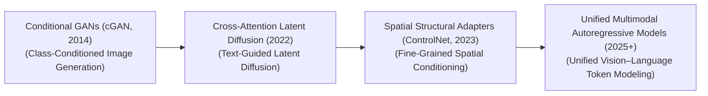
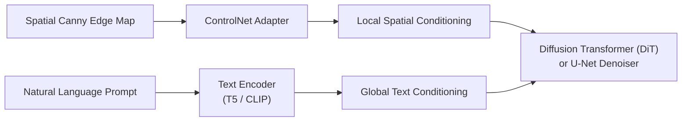

# Awesome-Conditional-Generation
## Conditional Generation in AI: History, Progression, Variants, & Applications

**Conditional Generation** is a foundational deep learning paradigm where a generative model synthesizes novel data samples (such as images, text, audio, or molecular structures) guided by explicit auxiliary information ($c$, the **Conditioning Signal**). In standard, unconditioned generation, a model samples randomly from an unguided latent distribution ($P(x)$), outputting realistic but arbitrary variants from the global data manifold (e.g., generating an unprompted face or a generic text paragraph). 

Conditional generation restructures the generation loop to model a conditional probability distribution ($P(x \mid c)$). This architecture allows human intention or structural context—expressed via class labels, textual prompt descriptions, edge maps, or parallel modality arrays—to precisely guide the model's trajectory, transforming generative AI from an unpredictable stochastic sampler into a highly steerable tool for engineering and design.

---

## 1. The Macro Chronological Evolution

The technical framework governing guided data synthesis has transitioned from rigid categorical class injections to text-conditioned joint-embedding alignments, structural spatial adapters, and unified multi-modal autoregressive sequence patches.

| Era | Concept | Significance / Limitation | Year | Paper |
| :--- | :--- | :--- | :--- | :--- |
| **[The Categorical One-Hot Injection Era (Conditional GANs](details/cgan.md), ~2014–2017)** | The theoretical genesis popularized by Mirza and Osindero. Early **Conditional Generative Adversarial Networks (cGANs)** injected conditioning constraints by concatenating a discrete, hand-crafted **One-Hot Encoded Class Label Vector** directly onto input noise arrays. | Extremely narrow and discrete. The model could only generate objects belonging to a pre-defined list of fixed indices, failing to process natural language. | 2014 | [Conditional Generative Adversarial Nets](https://arxiv.org/abs/1411.1784) |
| **[The Latent Space Text-Conditioned Era](details/latent_space.md) (Stable Diffusion, ~2022–2024)** | Spurred by **CLIP** and **Latent Diffusion Models (LDMs)**. Replaced rigid label vectors with continuous natural language embedding arrays. Vectors injected via **Cross-Attention Mechanisms** [INDEX: 10]. | Unlocked open-vocabulary text-to-image and text-to-video foundation scaling, mapping arbitrary linguistic concepts to precise pixel distributions [INDEX: 10]. | 2022 | [High-Resolution Image Synthesis with Latent Diffusion Models](https://arxiv.org/abs/2112.10752) |
| **[The Fine-Grained Spatial Structural Adapter Era](details/spatial_adapter.md) (~2023–2025)** | Addressed structural ambiguity of text prompts. Introduced **ControlNet** and **IP-Adapter**, which clone base network's convolutional blocks to feed extra spatial conditioning layers into frozen backbones. | Allows specification of exact pixel boundaries or human postures efficiently, bridging the gap between descriptive text and spatial structure. | 2023 | [Adding Conditional Control to Text-to-Image Diffusion Models](https://arxiv.org/abs/2302.05543) |
| **[The Unified Omni Autoregressive Token Era](details/omni_autoregressive.md) (~2025–Present)** | Collapses separate conditional projection heads, framing conditional generation as a monolithic autoregressive sequence task (e.g., GPT-4o, Chameleon). Modalities flattened into a single sequence [INDEX: 1]. | Conditioning behaves natively as a prefix complete-the-string logic block [INDEX: 1], optimizing cross-sensory synthesis cleanly. | 2024 | [Chameleon: Mixed-Modal Early-Fusion Foundation Models](https://arxiv.org/abs/2405.09818) |

---

## 2. Core Functional & Conditioning Variants

Conditional Generation models are strictly categorized based on the architectural mechanism deployed to pass the guiding signal into the hidden representation layers.

| Variant | Mechanism | Application / Detail | Year | Paper |
| :--- | :--- | :--- | :--- | :--- |
| **[A. Concatenation-Based Conditioning](details/concat_conditioning.md)** | The conditioning signal is concatenated directly along the channel or sequence dimension of the latent noise tensor before passing to primary convolution/attention weights. | The most entry-level architectural framework. | 2014 | [Conditional Generative Adversarial Nets](https://arxiv.org/abs/1411.1784) |
| **[B. FiLM / Featurewise Linear Modulation](details/film.md) (Adaptive Layer Scaling)** | A secondary network processes conditioning signal ($c$) to output scaling ($\gamma$) and shifting ($\beta$) parameters. Modulates hidden feature maps ($x$): $\text{FiLM}(x \mid c) = \gamma(c) \odot x + \beta(c)$ | Standard building block inside modern text-to-speech audio wave networks and early conditional CNNs. | 2018 | [FiLM: Visual Reasoning with a Feature-Wise Linear Modulation](https://arxiv.org/abs/1709.07871) |
| **[C. Cross-Attention Mask Conditioning](details/cross_attention.md)** | Latent features generate Queries ($Q$), text encoder maps string into Keys ($K$) and Values ($V$) [INDEX: 10]. Executes dot-product alignments to conform to prompt metrics. | The default structural baseline used inside diffusion architectures. | 2022 | [High-Resolution Image Synthesis with Latent Diffusion Models](https://arxiv.org/abs/2112.10752) |
| **[D. Classifier-Free Guidance (CFG Trajectory Steering)](details/cfg.md)** | Evaluates conditional pass and unconditioned null-token pass concurrently, multiplying delta by a scale factor to push latent vector along a semantic trajectory [INDEX: 23]. | A runtime sampling modification that enforces prompt compliance [INDEX: 23]. | 2021 | [Classifier-Free Diffusion Guidance](https://arxiv.org/abs/2207.12598) |

---

## 3. The Multi-Modal Conditioning Interaction Matrix

To steer data generation safely through multi-layered networks, enterprise orchestration systems layer spatial structural adapters alongside global textual embeddings concurrently.

| Component | Profile | Year | Paper |
| :--- | :--- | :--- | :--- |
| **[ControlNet Adapter Channels](details/controlnet.md)** | Fine-grained geometric layout control. Copies structural parameters of a frozen foundation model, processing spatial arrays to inject a localized spatial bias, protecting composition boundaries. | 2023 | [Adding Conditional Control to Text-to-Image Diffusion Models](https://arxiv.org/abs/2302.05543) |
| **[Omni Tokenizer Patch Builders](details/omni_tokenizer.md)** | Collapses data-modality fragmentation. Transforms multi-sensory files into standard token grids [INDEX: 1]. Conditioning is handled as a standard left-to-right causal masking sequence [INDEX: 1]. | 2024 | [OmniTokenizer: A Joint Image-Video Tokenizer for Visual Generation](https://arxiv.org/abs/2406.08224) |

---

## 4. Production Engineering Challenges & Hardening Mitigations

Deploying and scaling complex conditional generation loops across massive commercial cloud infrastructures introduces unique memory bus and computational bottlenecks.

| Challenge | Problem | Mitigation | Year | Paper |
| :--- | :--- | :--- | :--- | :--- |
| **[The Double-FLOP Evaluation and Serving Latency Wall](details/double_flop.md)** | Enforcing precise text conditioning via CFG requires evaluating conditional and unconditioned tracks at every step, doubling compute costs [INDEX: 23]. | Implementing **Speculative CFG Skipping**, calculating the unconditioned loop exclusively during the early 60% of composition steps [INDEX: 23]. | 2021 | [Classifier-Free Diffusion Guidance](https://arxiv.org/abs/2207.12598) |
| **[The Attention Sequence Cache Memory Crisis](details/attention_cache.md)** | Concatenating massive text inputs with ultra-long visual patch sequences explodes the self-attention matrix size in DiTs, saturating GPU VRAM. | Compiling cross-attention blocks into **fused FlashAttention kernels**, executing text-image alignments within fast GPU SRAM [INDEX: 23]. | 2022 | [FlashAttention: Fast and Memory-Efficient Exact Attention with IO-Awareness](https://arxiv.org/abs/2205.14135) |

---

## 5. Frontier Real-World AI Industrial Applications

| Application | Details | Year | Paper |
| :--- | :--- | :--- | :--- |
| **[Text-to-Image & Generative Graphic Production](details/text_to_image.md) (Midjourney / FLUX.1)** | Powers commercial asset platforms. Transformers ingest descriptive commands, using CFG to synthesize high-resolution marketing and digital art natively [INDEX: 23]. | 2024 | [FLUX.1: Flow-matching scaling laws over conditioned transformer token arrays](https://blackforestlabs.ai/) |
| **[Spatio-Temporal Video Synthesis and Cinematic Pre-Visualization](details/spatio_temporal.md)** | Drives automated cinema composition. Spatio-temporal diffusion transformers ingest multi-modal constraints to generate fluid, consistent multi-second video animations. | 2024 | [Video generation models as world simulators](https://openai.com/research/video-generation-models-as-world-simulators) |
| **[De Novo Bio-Informatics Molecular Target Optimization](details/de_novo.md)** | Accelerates drug discovery (AlphaFold 3 / RFdiffusion). Equivariant diffusion networks condition generation on chemical binding criteria, synthesizing novel protein structures. | 2023 | [De novo design of protein structure and function with RFdiffusion](https://www.nature.com/articles/s41586-023-06415-8) |

---

## References
1. Mirza, M., & Osindero, S. (2014). Conditional generative adversarial nets. *arXiv preprint arXiv:1411.1784*.
2. Perez, E., et al. (2018). FiLM: Visual reasoning with a featurewise linear modulation. *Proceedings of the AAAI Conference on Artificial Intelligence*, 32(1).
3. Ho, J., & Salimans, T. (2021). Classifier-free diffusion guidance. *NeurIPS Workshop on NeurIPS* [INDEX: 23].
4. Rombach, R., et al. (2022). High-resolution image synthesis with latent diffusion models. *Proceedings of the IEEE/CVF Conference on Computer Vision and Pattern Recognition (CVPR)* [INDEX: 10].
5. Zhang, L., Rao, A., & Agrawala, M. (2023). Adding conditional control to text-to-image diffusion models. *Proceedings of the IEEE/CVF International Conference on Computer Vision (ICCV)*.
6. Black Forest Labs. (2024). FLUX.1: Flow-matching scaling laws over conditioned transformer token arrays. *Open-Source Generative Architecture Manifesto*.

---

To advance this documentation repository, conditional framework blueprint, or deployment pipeline, consider exploring these adjacent development pathways:
* Build a **Python code snippet using PyTorch** illustrating how to construct a standard Featurewise Linear Modulation (FiLM) layer module from scratch, including affine parameter applications.
* Generate a **comprehensive Markdown table** explicitly comparing Concatenation Conditioning, FiLM Layers, Cross-Attention Masking, and Structural Adapters (ControlNet) across entry lifecycle points, mathematical computational complexity bounds, structural VRAM memory footprints, and spatial precision control thresholds.
* Establish an **automated performance profiling notebook using Triton** to track the exact computational throughput and memory bus latency metrics achieved when fusing a cross-attention conditioning loop directly inside single-pass GPU register blocks.

***

**Follow-Up Options Matrix:**

Before updating this documentation repository layout, let me know how you would like to proceed by choosing one of the options below:
* I can provide a **complete Python code boilerplate using PyTorch** demonstrating how to write an automated script that calculates a conditional image-to-image cross-attention pass.
* I can generate a **Markdown matrix table** tracking the specific network dimensions, text encoders, and latent channel counts used by leading enterprise repositories to execute high-fidelity conditional token generation.
* I can write a detailed technical explanation focusing on the **mathematics of Classifier-Free Guidance scale modulation** and how it steers probability density curves during inference [INDEX: 23].

