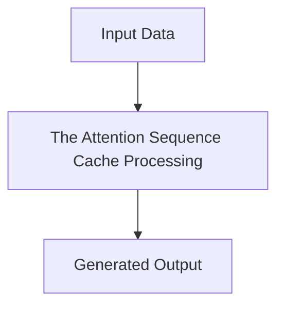

# The Attention Sequence Cache Memory Crisis

## Detailed Information
This section provides in-depth information about **The Attention Sequence Cache Memory Crisis**.

For more details, see the main [README](../README.md).
