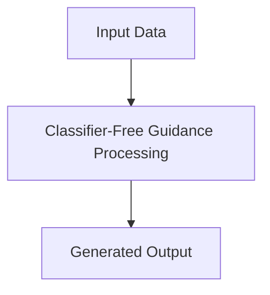

# Classifier-Free Guidance

## Detailed Information
This section provides in-depth information about **Classifier-Free Guidance**.

```mermaid
graph TD;
    A[Input Data] --> B[Classifier-Free Guidance Processing];
    B --> C[Generated Output];
```

For more details, see the main [README](../README.md).
