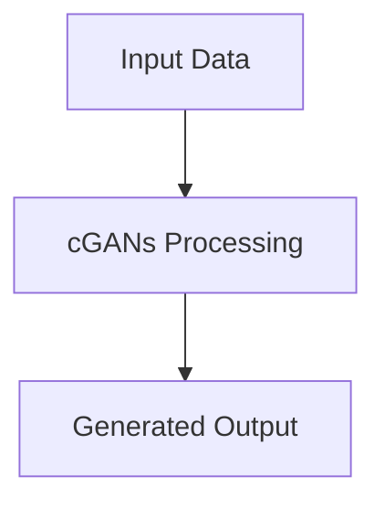

# Conditional Generative Adversarial Networks

## Detailed Information
This section provides in-depth information about **Conditional Generative Adversarial Networks**.

For more details, see the main [README](../README.md).
