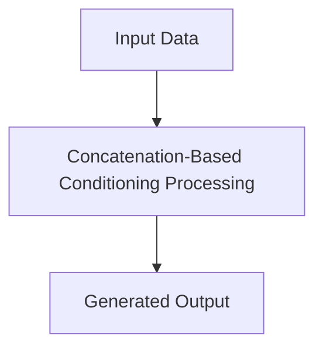

# Concatenation-Based Conditioning

## Detailed Information
This section provides in-depth information about **Concatenation-Based Conditioning**.

For more details, see the main [README](../README.md).
