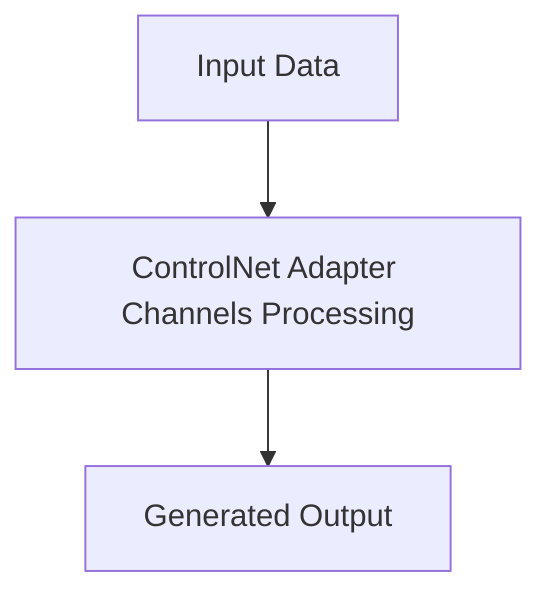

# ControlNet Adapter Channels

## Detailed Information
This section provides in-depth information about **ControlNet Adapter Channels**.

```mermaid
graph TD;
    A[Input Data] --> B[ControlNet Adapter Channels Processing];
    B --> C[Generated Output];
```

For more details, see the main [README](../README.md).
