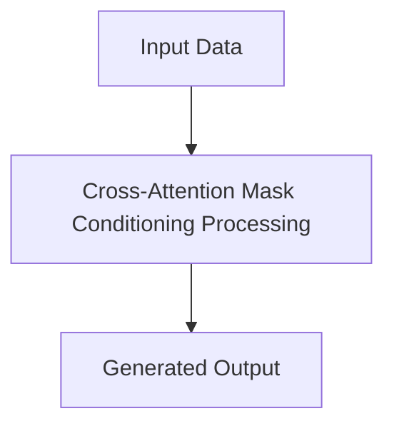

# Cross-Attention Mask Conditioning

## Detailed Information
This section provides in-depth information about **Cross-Attention Mask Conditioning**.

For more details, see the main [README](../README.md).
