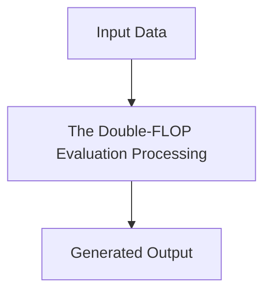

# The Double-FLOP Evaluation and Serving Latency Wall

## Detailed Information
This section provides in-depth information about **The Double-FLOP Evaluation and Serving Latency Wall**.

For more details, see the main [README](../README.md).
