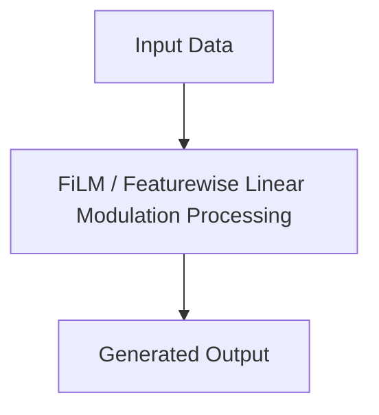

# FiLM / Featurewise Linear Modulation

## Detailed Information
This section provides in-depth information about **FiLM / Featurewise Linear Modulation**.

For more details, see the main [README](../README.md).
