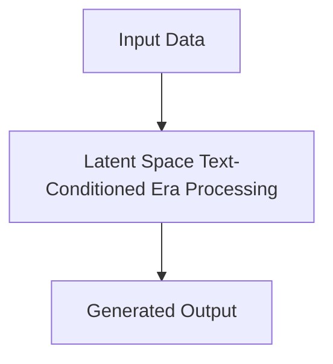

# Latent Space Text-Conditioned Era

## Detailed Information
This section provides in-depth information about **Latent Space Text-Conditioned Era**.

For more details, see the main [README](../README.md).
