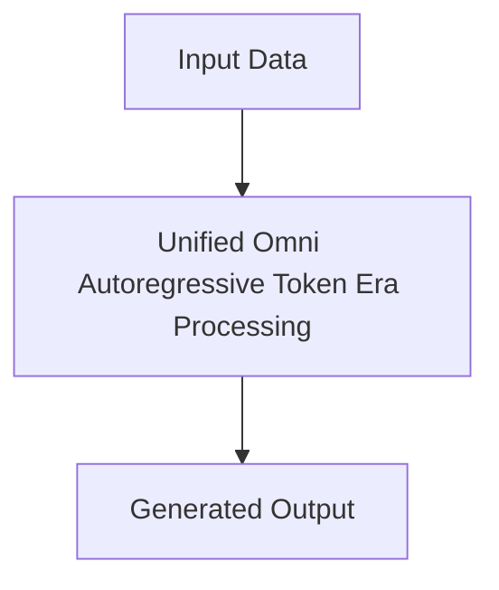

# Unified Omni Autoregressive Token Era

## Detailed Information
This section provides in-depth information about **Unified Omni Autoregressive Token Era**.

For more details, see the main [README](../README.md).
