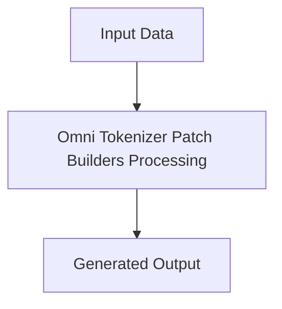

# Omni Tokenizer Patch Builders

## Detailed Information
This section provides in-depth information about **Omni Tokenizer Patch Builders**.

```mermaid
graph TD;
    A[Input Data] --> B[Omni Tokenizer Patch Builders Processing];
    B --> C[Generated Output];
```

For more details, see the main [README](../README.md).
