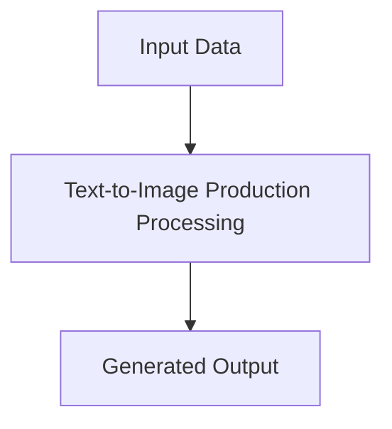

# Text-to-Image & Generative Graphic Production

## Detailed Information
This section provides in-depth information about **Text-to-Image & Generative Graphic Production**.

For more details, see the main [README](../README.md).
